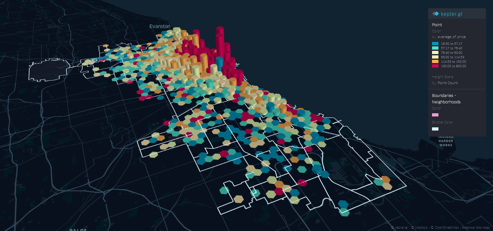
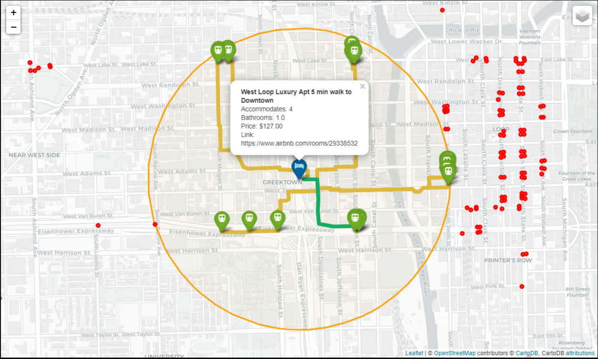
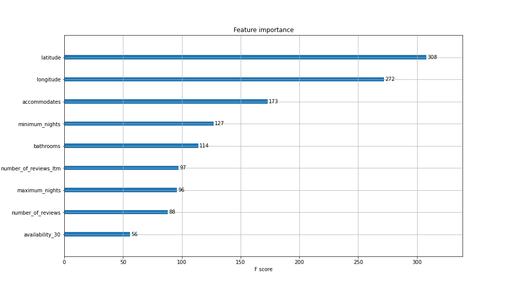
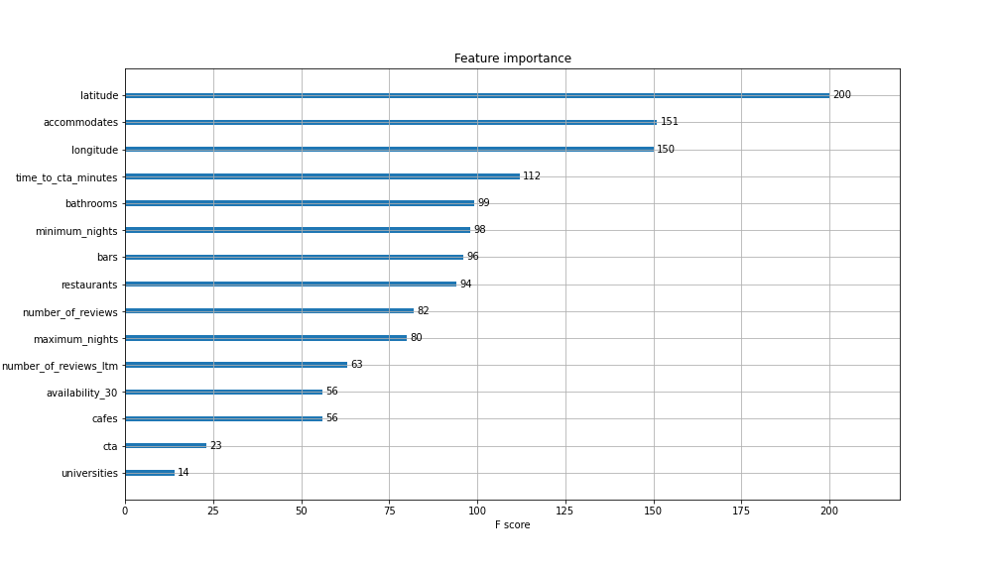

# Airbnb Price Prediction Project (Chicago) 

This project's aim is to build a price prediction model based on Chicago Airbnb Listings dataset available from [InsideAirbnb](http://insideairbnb.com/get-the-data.html). The dataset is further extended by creating new variables based on geospatial analysis.

### Table of Contents

1. [Foreword](#foreword) 
2. [Installation](#installation)
3. [File Descriptions](#files)
4. [Results](#results)
5. [Resources](#resources)

## Foreword <a name="foreword"></a>

This project is a part of James Rocco Research Scholarship provided by Lake Forest College and was carried out under the supervision of Prof. Arthur Bousquet. The main idea is based on an article by Graciela Carrillo posted on [Towards Data Science](https://towardsdatascience.com/predicting-airbnb-prices-with-machine-learning-and-location-data-5c1e033d0a5a). 

## Installation <a name="installation"></a>

Using Anaconda create a new environment from environment.yml. 

```python
conda env create --file environment.yml
```

## File Descriptions (Follow in order) <a name="files"></a>

To conveniently read all the notebooks follow this [link](https://nbviewer.jupyter.org/). 

1. [EDA.ipynb (Exploratory Data Analysis)](https://github.com/amac-lfc/airbnb/blob/master/EDA.ipynb) - A brief overview and analysis of raw data
2. [kepler_map.ipynb](https://github.com/amac-lfc/airbnb/blob/master/kepler_map.ipynb) - Visualization of the whole dataset using [Kepler.gl](http://kepler.gl) 
3. [data_preprocessing.ipynb](https://github.com/amac-lfc/ airbnb/blob/master/data_preprocessing.ipynb) - Preprocessing the data for future uses (outlier detection, feature selection, handling missing data, etc.) 
4. [regressions.ipynb](https://github.com/amac-lfc/airbnb/blob/master/regressions.ipynb) - Development of initial price prediction models
5. [geo_loc.py](https://github.com/amac-lfc/airbnb/blob/master/geo_loc.py) - A python script for geospatial analysis: creates 5 new variables using such libraries as [OSMnx](https://github.com/gboeing/osmnx) and [OpenRouteSerivce](https://github.com/GIScience/openrouteservice-py):
    - Restaurants - Number of restaurants in a 1000 meters radius
    - Cafes - Number of cafes in the radius
    - Bars - Number of bard in the radius
    - CTA - Number of CTA (Chicago Subway) stations in the radius
    - time_to_cta_minutes - Time in minutes to the nearest CTA station (can be out of the radius)
6. [cta_mapping.ipynb](https://github.com/amac-lfc/airbnb/blob/master/cta_mapping.ipynb) - Visualization of geo_loc.py using [Folium](https://python-visualization.github.io/folium/index.html) maps (Map of routes to CTAs in the radius and shortest path detection)

## Project Description and Results <a name="results"></a>

<b> The main goal of this project is to build a model that predicts the price of a listing given its dependent variables. </b> The data for both dependent and independent variables is available through Insideairbnb.com. To get a general understanding of the data used for this project, take a look at the map below where the data is projected on the map of Chicago. Listings (i.e. rows in the dataset) are grouped within hexagons whose height represents the listings count and the color represents the price range. 

 

The accuracy, i.e. how well the model performs, is measured by R^2  a metric commonly used for regression models that represents the proportion of the variance for a dependent variable that's explained by independent variables. To further improve the accuracy and add originality to the project, 5 new variables are created by analyzing surrounding areas and fetching distances to chosen types of locations as well as calculating the walking time to the nearest subway station. 

Since it is possible to visualize locations and routes, below you can see a map with routes to all subway stations within the range of 1000m (the circle) and with the shortest route colored in green. Red dots represent subway station that lie outside the wanted radius. 




Here is the list of variables used to predict the price of a listings:

<b> Numerical variables:  </b>
- Accommodates - Number of people a listing can accommodate 
- Bathrooms - Number of bathrooms 
- Minimum_nights - Minimum amount of nights a listing should be booked for 
- Maxium_nights - Maximum amount of nights a listing can be booked for
- Availability_30 - Number of days a listing is available in the next 30 days 
- Number_of_reviews - Total number of reviews 
- Number_of_reviews_ltm - Number of reviews within last month 
- Restaurants, Bars, Cafes, Universities - Number of places of specified type within 1000 meters from the listing (4 different variables) 
- Time_to_cta_minutes - Time it takes to walk to the nearest subway (in Chicago CTA) station (Distance does not matter) 

<b> Categorical variables: </b> 
- Neighbourhood_cleansed - name of the neighborhood a listing is located in 
- Property_type - type of property a listing is located in (e.g. Apartment, Condomonium, House, etc.) 
- Bed_type - type of bed present in a listing 
- Cancellation_policy - type of cancellation policy chosen by the host 


As it can be apparent from file descriptions, a step-by-step approach was taken to build the model. To understand the model and the thought process you can read through the notebooks.

To achieve the best possible result I tried various models and these are the results: 

_ | Linear Regression | Lasso Regression | Ridge Regression | Lasso Regression with Polynomial Features| Ridge Regression with Polynomial Features | XGBoost | 
------------ | ------------- | ------------- | ------------- | ------------- | ------------- | ------------- | 
<b> No new variables: </b> <br/>Train R<sup>2</sup>  | 0.4298 | 0.4294 | 0.4296 | 0.4918 | 0.5143 | 0.6428
Test R<sup>2</sup> | 0.4607 | 0.462 | 0.4615 | 0.4867 | 0.4925 | 0.5391
<b> With new variables: </b> <br/>Train R<sup>2</sup> | 0.4387 | 0.4375 | 0.4384 | 0.5036 | 0.5224 | 0.6742
Test R<sup>2</sup> | 0.411 | 0.4163 | 0.4129 | 0.4503 | 0.453 | 0.5445

A good way to see the difference in modeling between the data without and with the new variables is to look at feature importances computed by XGBoost. Categorical variables are not included not to overcrowd the plot. 

As we can see on the bottom plot the new features possess high importance (higher than some of the initial features). 


 


## Resources <a name="resources"></a>

1. [https://www.youtube.com/playlist?list=PLLssT5z_DsK-h9vYZkQkYNWcItqhlRJLN](https://www.youtube.com/playlist?list=PLLssT5z_DsK-h9vYZkQkYNWcItqhlRJLN) - Complete Machine Learning Course by Andrew NG
2. [https://campus.datacamp.com/courses/pandas-foundations/](https://campus.datacamp.com/courses/pandas-foundations/) - Pandas Foundations Course on DataCamp
3. [https://learn.datacamp.com/courses/unsupervised-learning-in-python](https://learn.datacamp.com/courses/unsupervised-learning-in-python) - Unsupervised Learning Course on DataCamp
4. [https://learn.datacamp.com/courses/supervised-learning-with-scikit-learn](https://learn.datacamp.com/courses/supervised-learning-with-scikit-learn) - Supervised Learning Cousr on DataCamp
5. [https://www.textbook.ds100.org/intro.htmlPrinciples](https://www.textbook.ds100.org/intro.htmlPrinciples) and Techniques of Data Science By Sam Lau, Joey Gonzalez, and Deb Nolan
6. [https://github.com/Jie-Yuan/FeatureSelector/blob/master/Feature%20Selector%20Usage.ipynb](https://github.com/Jie-Yuan/FeatureSelector/blob/master/Feature%20Selector%20Usage.ipynb) - Feature_Selector packagew
7. [https://towardsdatascience.com/airbnb-price-prediction-using-linear-regression-scikit-learn-and-statsmodels-6e1fc2bd51a6](https://towardsdatascience.com/airbnb-price-prediction-using-linear-regression-scikit-learn-and-statsmodels-6e1fc2bd51a6) - Simmilar Price Prediciton model for Airbnb data
8. [https://towardsdatascience.com/ridge-and-lasso-regression-a-complete-guide-with-python-scikit-learn-e20e34bcbf0b](https://towardsdatascience.com/ridge-and-lasso-regression-a-complete-guide-with-python-scikit-learn-e20e34bcbf0b) - Explanation of the theory behind Lasso and Ridge Regressions
9. [https://www.youtube.com/watch?v=Q81RR3yKn30](https://www.youtube.com/watch?v=Q81RR3yKn30) - Ridge Regression
10. [https://www.youtube.com/watch?v=NGf0voTMlcs](https://www.youtube.com/watch?v=NGf0voTMlcs) - Lasso Regression
11. [https://www.youtube.com/watch?v=1dKRdX9bfIo&t=219s](https://www.youtube.com/watch?v=1dKRdX9bfIo&t=219s) - Elastic Net Regression
12. [https://www.youtube.com/watch?v=0GzMcUy7ZI0](https://www.youtube.com/watch?v=0GzMcUy7ZI0) - Theory behind PCA
