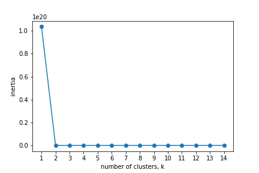

# Airbnb Project Report #1

by Samvel Gevorgyan 

## Purpose of this project

The primary goal of this project is to trace the relationship between various factors that characterize a given Airbnb listing and its price. Since most of the features (like number of beds, bathrooms, etc.) are not unique to a given listing, i.e. are not representative enough of the price variable, a big emphasis is going to be put on the location of the listing. From my and other people's experience with Airbnb it is a known fact that listing with the best location (primarily in the city or the business centers) have the highest prices. In this project I will be trying to define what is the best location. 

## Exploratory Data Analysis

Before I jump into the primary goal of the project, it is necessary to understand the data. Exploratory Data Analysis is a set of methods used by Data Scientists for these purposes. Moreover, while exploring the data, I can trace its inconsistencies (missing values, wrong data types, etc.). 

First of all, for the purposes of primary exploratory data analysis I am dropping the columns that mostly contain string objects (text) and hence are not very useful in exploring the data. 

However, the non-numeric variables are not the only problem, there are still numerous variables present in the dataset that are not very necessary and instead of helping us understand and read the data, they add extra complexity that can be avoided. 

Let's look into one of these variables called 'maximum_minimum_nights'. Due to the lack of documentation for the dataset I was unable to identify the purpose of this variable. Before thoughtlessly dropping this and other similar variables, let's take a look at how does this data fit in the overall model. For this, I will be using the KMeans clustering algorithm that (on the very basic levels) finds patterns in the data and groups it into specified number of clusters K. In order to choose the best number of clusters something called the 'elbow method' is used, it will be clear in a moment why it is called like this. For us to see the 'elbow' I will initialize a function that plots the inertias (or the distance to centroids, points that best describe a given cluster, identified by the KMeans) depending on the number of clusters. 

 

Oh! Something went completely wrong in here. Let's figure out what is the matter. 

_ | Latitude | Accommodates | Price | Minimum Nights | Maximum Nights | Availability_30 
------------ | ------------- | ------------- | ------------- | ------------- | ------------- | ------------- 
count |	8355 | 8355 |	8355 |	8355 |	8355 | 8355 
mean | 41.897565 | 	4.228606 | 134.203232 |	6.371155 | 674.135248 |	17.29599
std	| 0.059075 |	2.861694 |	116.812175 |	18.4367 |	527.683597 |	12.951869
min |	41.64736 |	1	| 10 |	1 |	1 |	0
25% |	41.87149 |	2	| 60 | 1 | 30.5 |	0
50% |	41.90032 |	4 |	100 |	2 |	1125 |	23
75% |	41.938995 |	6 |	159 |	3 |	1125 |	30
max |	42.02251 | 30 |	800 |	500 |	9000 | 30

As we can see from the selected variables above the standard deviations differ greatly meaning that it is impossible to compare them. For this very reason the graph above had that incorrect shape. 

What we can do about this is to scale our data. Scaling the data means to bring it into some standardized form. In this case I will be using StandardScaler function available from the Sklearn library. What it does, it sets the mean to 0 and the standard deviation to 1 for every individual variable. 

$$z = (x - \mu) / \sigma  $$

After applying the method on our data and calling the inertia ~ cluster graph again we can see an obvious improvement in our model.

But where is the elbow? The problem now lies in those extra variables that do not bear any statistical significance to our model. Let's remove them, scale our data again and see the results. 

.png)

This looks much better! As we can see the elbow lies between k equaling 2 and 4, meaning that the best suitable number of clusters is 3. Now when our data is ready for further exploration, let see the relationship between some of the variables and the price. 

On the scatterplot above the price is on the x-axis and the number a given listing can accommodate on the y-axis. From the graph we can see that there is no clear relationship between these two variable but what we can see is the presence of multiple outliers that might negatively impact our data. It is apparent that most of the data lies in the lower price range (below 2000). Moreover, in the future the goal is to be able to predict the best price for a property when listed on Airbnb and these 'special' cases are not the goal of the model, therefore let's focus on the 'normal' cases. We want to know what percentage of the data lies above the $2000, $1000, and $800 mark and if it is small enough we can drop these 'special' listings. Also, let's check for faulty listings with a price of 0 dollars. 

Output of the function checking these 4 statements:

> *Percentage of listings with price greater than $2000: 0.41079812206572774 %
Percentage of listings with price greater than $1000: 0.9624413145539906 %
Percentage of listings with price greater than $800: 1.9014084507042253 %
Number of listing with price equal to zero: 3*

As we can see roughly only 2% of all data lies above the $800 per night mark. If we drop this 2 percent it is not going to be a great loss and it will make it possible for us to focus on the 'normal' listings ($800 per night is luxurious enough). 

The scatterplot above shows a similar relationship to the last one, but this time with the number of bathrooms on the y-axis. Also since we dropped the extra luxurious listings, the data seems to be better distributed but with an apparent left skew. This further can be seen when we plot a boxplot of the 'price' variable. 

Now, finally, let's apply the KMeans clustering on out data and see if there is any clear and apparent way to trace the origin of the clusters, i.e. what variable is the most representative of clusters. 

)

.png)

.png)

As we can see, unfortunately, at this stage neither of the variables demonstrate the clusters (that are represented in 3 colors) clearly. Meaning there has to be additional work to be put to identify the varying clusters. 

What we can do at this stage is to apply PCA (Principal Component Analysis) that is an algorithm that is used primarily for dimensionality reduction (dimensions meaning variables). This way instead of our initial 19 independent variables and the price (the dependent variable), we can have 2 independent and 1 dependent. Another great outcome of dimensionality reduction is the ability to graph the data. 

Now, our clusters are more representative and can be easily identified on this plot. However, the problem with PCA and this plot is that even though we can see the clusters now, it is unknown what these newly generated dimensions (namely PCA Variable #1 and PCA Variable #2) represent and thus their practical implementation is limited. 

Lastly, let's try to apply a simple Linear Regression to our model and see if it can accurately guess the price given the variables. 

The linear model produces these two metrics:

> R^2: 0.36123366642285204
Root Mean Squared Error: 91.64320094900793

These two measurements reveal that only 36% of our data fits the model and that on average the price 'guessed' by the model is $91.6 off the real one. 

## Learning Material

Most of the material was learned through the courses provided by the DataCamp platform. These are: 

1) Pandas Foundations 

2) Unsupervised Learning in Python

3) Supervised Learning with scikit-learn 

Also Python Data Science Handbook by Jake Van Der Plas was used for reference.
