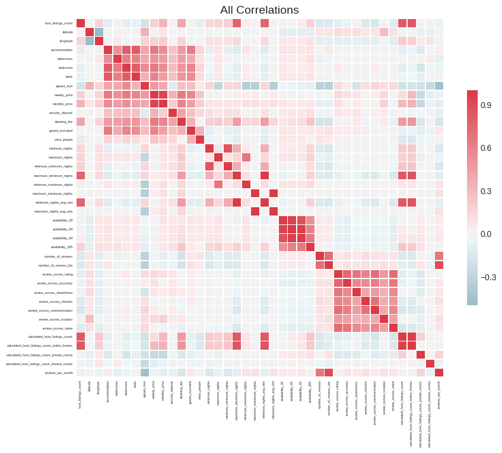

# Airbnb Project Report #2

## Introduction

On the second stage of the project, I deep dived into regression and possible ways to maximize the utility of regressions through regularization. However, to achieve the best possible result I had to master the data preprocessing step to format the raw data and make it suitable for future use. After I perform all the necessary steps of dropping the insignificant data and formatting the existing one, linear models were applied to it, namely, Lasso & Ridge Regression (also known as $L_1$ and $L_2$ Regularization) as well as the combination of these two with polynomial regression. 

## Data Preprocessing /  A new approach

Even though most of the data preprocessing was explained in the previous report, during my research I stumbled upon an article that presented `Feature_Selector` - a Python library made to help during the data preprocessing stage and make the process smooth and easy. The description of the package can be found on [its GitHub page](https://github.com/Jie-Yuan/FeatureSelector). 

First, since the package does not come by default with the Python distribution it is necessary to install it using `pip install feature_selector`

Second, after creating a *FearureSelector* object we gain access to 5 methods by which missing data can be identified and handled:

1. Missing Values
2. Single Unique Values
3. Collinear Features
4. Zero Importance Features
5. Low Importance Features

By using the first method, Missing Values, we can create a histogram of the missing data. The parameters of the identify_missing method allow us to choose a threshold above which we want to find the missing data. For my purposes I use a threshold of 0 (meaning I want any proportion of missing values to be included. The data used for this plot is the raw data about Airbnb listings in Chicago accessible [here](http://insideairbnb.com/get-the-data.html). 

As we can see our raw data contains quite a few missing values. The bars on the left represent the columns (more than 30 in total) where the proportion of missing data is in range from 0 to 0.3 (on the x-axis). The bar on the most right represents 3 columns where exactly or more than 90% is missing. In case we want to break this plot down we can access the information regarding the proportions of missing values by calling the missing_stats method of our *FeatureSelector* (fs) object. 

Variable Name | Missing Fraction
------------ | -------------
square_feet |	0.994484
monthly_price |	0.942019
weekly_price |	0.940493

The single unique value method is not going to be explained in this report but it is very useful for columns with unevenly distributed data where one value dominates a large proportion of all data within the column. The next method is widely used and essential for a good machine learning model. For a good linear model to perform well it is essential to drop highly correlated feature and thus avoid multicollinearity. The reason for this is that highly correlated features are linearly dependent and hence have a similar effect on the target variable. First to understand the idea behind multicollinearity let us explore the correlations between all the variables in our dataset (excluding our target variable - *price*) by calling `fs.plot_collinear(plot_all=True)`.

As we can see the large number of features does make it hard for us to manually identify features with high correlation. Luckily, the FeatureSelector object has `identify_collinear`

method that identifies features with correlation above the specified threshold. In my case, the threshold is going to be 0.8. Let us take a look at a reduced correlation matrix only containing features with correlation above the threshold. 

If we want to access the full list of features that were identified to be highly correlated and need to be dropped we need to call `fs.ops['collinear']` . 

The other two methods of identifying insignificant data are both built upon the [LightGBM library](https://lightgbm.readthedocs.io/en/latest/Quick-Start.html) with which I am yet unfamiliar and therefore I am not going to rely much on these methods however I will still demonstrate their use. Zero importance features method requires us to specify the machine learning algorithm that we are going to implement and what metric is going to measure model's performance. In our case the task (the algorithm) is `regression` and the evaluation metric is `l2` or the mean squared error (the squared residual). Then if we want to see the bar plot of feature importances we can call `fs.plot_feature_importances` and get a similar looking plot. 

Moreover, we can specify and importance threshold within the `plot_feature_importances` function and see how many features our model requires to reach a certain level of cumulative importance. For my model I specified a threshold of 99%. 

From the graph we can see that we need 36 out of our 40 features to reach a cumulative importance of 99%. If you are confused about the cumulative importance think of the 36 variables containing 99% of total information about the dataset, meaning that the other 4 features do not carry that much of importance. And, finally, the last method is the logical continuation of the previous one. It identifies the features that do not contribute to the cumulative importance past the threshold. On the plot above we can see that there are 4 variables to the right of the blue-dashed line, the following code is going to identify these variables: `identify_low_importance(cumulative_importance = 0.99).`

# Model Development

## Multiple Linear Regression

After preparing the dataset, I implemented a Linear Regression model accessible through the Sklearn library in python. Before we feed our data to the model we need to scale it (the process of scaling was explained in the Report #1). A generalized linear regression model has the following equation: $fθ(x)=θ_0+θ_1x_1+…+θ_px_p$, where $θ_p$ (theta) represents the coefficient assigned to the variable p and $x_p$ represents the variable itself. The goal of our model implemented using the Sklearn library is to minimize the cost function, i.e. find coefficients for each variable that result in the least possible sum of squares (distance between the predicted point and the original point). The cost function has the following form.

Our goal is to minimize the residuals of our data (minimize the sum of squares) and maximize the proportion of data explained by our model - $R^2$. R-squared ($R^2$) is a statistical measure that represents the proportion of the variance for a dependent variable that's explained by an independent variable or variables in a regression model. For our first linear model the R-squared is equal to **0.3693**. Let's take a look at how residuals are positioned in comparison to the original data. On the plot, the points that were correctly predicted are positioned at the blue line. 

As we can see from the plot our model is far from ideal. Let us now modify our initial linear model by adding a new regularization term. 

## $L_1$ Regularization - Lasso Regression

Lasso Regression is a type of linear regression regularization, a method of penalizing large weights in our cost function to lower model variance. What it does is it adds a regularization (bias) term. Notice the equation below and compare it to the original cost function. Note that the new parameter  $λ$ is predefined and is used to finetune the model. Since the theta in the very end is put in absolute value it is possible for this model to assign 0 weights to certain variables. Therefore, Lasso can serve as a feature selection algorithm at the same time. To see the feature importance we can refer to the LASSO Path plot. There is much more to this plot other than feature selection, however for my current purposes it is going to serve as a complimentary visualization for the Lasso regression. Feature importances correspond to the order from left to right, the leftmost one being the most important (on the plot below it is the accommodates feature) and the rightmost one being the least important (maximum_nights). 

However, seemingly, because of the nature of our data, the Lasso regression did not significantly improve the $R^2$ and gave us a result of **0.3705.**

## $L_2$  Regularization - Ridge Regression

Ridge regression is almost identical to Lasso besides the coefficient $θ_p$ is squared (in Lasso the absolute value is taken). The formula for Ridge is of the following form: 

The resulting $R^2$  is slightly higher relative to the Lasso's one but still is far from best: **0.3715.** 

## Polynomial Regression

At this stage it seems like we have achieved the maximum possible results given our dataset without altering the data. Now what we can do is to transform our model to a polynomial one. To understand the difference between the two take a loot at the pictures below. 

As we can see thanks to this transformation of our data, the model can predict the results better because the best-fit line is not straight anymore and hence can account for anomalies in our data. To understand the application of this model on our data let us apply the Polynomial Features method available from Sklearn and see the resulting variables. Note: for mathematical purposes instead of having names our variables are indexed from $x_0$  to $x_i$. 

> '1', 'x0', 'x1', 'x2', 'x3', 'x4', 'x5', 'x6', 'x7', 'x8', 'x9', 'x0^2', 'x0 x1', 'x0 x2', 'x0 x3', 'x0 x4', 'x0 x5', 'x0 x6', 'x0 x7', 'x0 x8', 'x0 x9', ......... , 'x5^2', 'x5 x6', 'x5 x7', 'x5 x8', 'x5 x9', 'x6^2', 'x6 x7', 'x6 x8', 'x6 x9', 'x7^2', 'x7 x8', 'x7 x9', 'x8^2', 'x8 x9', 'x9^2'

Initially, our dataset contained only 10 features when now it contains 66 features (that is 56 more!). These variables are automatically generated and hence their relevance can differ. What we can do to undermine the new insignificant variables is to apply Lasso Regression to achieve a better result. The resulting $R^2$ is **0.432** which compared to other improvements is the biggest so far (the best result before was 0.3705). To visually trace the difference between the multiple linear regression model and this model take a look at how the predicted price values correspond to their originals. 

