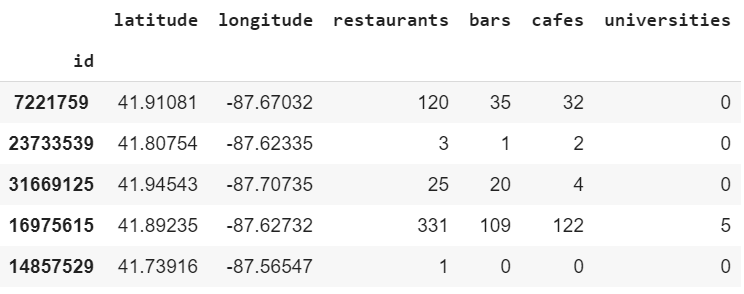
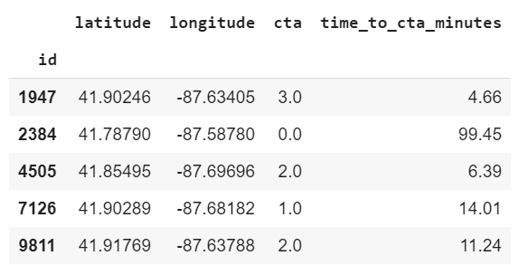
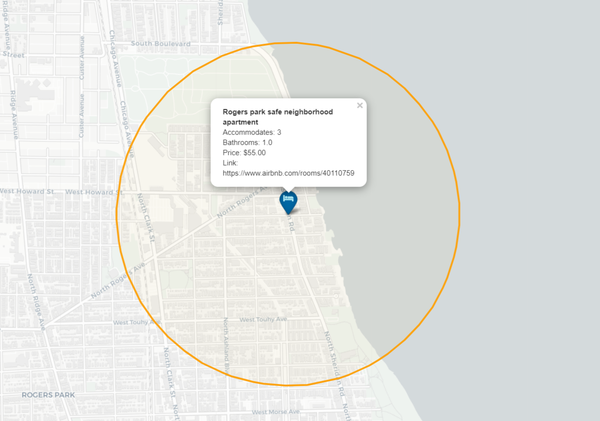
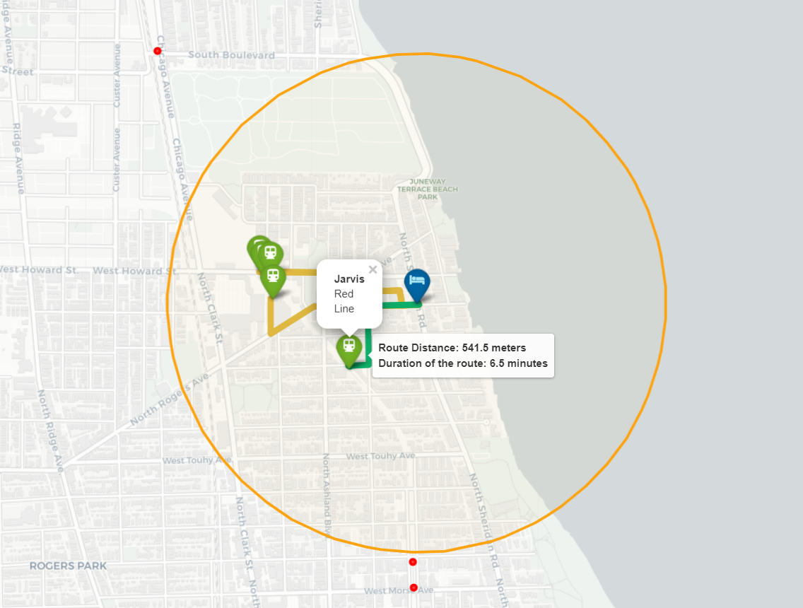

# Airbnb Project Report #3

## Introduction

As it was initially planned, part of my project is to generate new data that can offer us new insights on the data as well as improve the performace of the price-predicting model. Particularly, for the purposes of the project I am interested in geospatial analysis, i.e. the analysis of location of each of the Airbnb listings. What I am going to analyze is the proximity of other locations such as restaurants, cafes, bars, universities, and CTA (Chicago Subway) stations. Throught the report all of these places are going to be called amenities (you will find out why soon). In particular, I am going to find the number of each of the amenities within 1000 meters (0.6 miles) as well as the walking time in minutes to the closest CTA station (no matter the distance). A variety of tools and python packages were used to achieve the result and in this report I am going to walk you through the process. 

## Computing New Variables

### Restaurants, cafes, bars, and universities

As the first part of the new data computation I am going to compute the number of restaurants, cafes, bars, and universities in a radius of a 1000 meters from each Airbnb listing. Due to the simmilar type of these amenities their computation algorythm is the same. To calculate these I am going to use a Python package called [OSMnx](https://github.com/gboeing/osmnx). OSMnx is a street network analysis tool that is closely tied to [OpenStreetMap API](https://wiki.openstreetmap.org/wiki/Main_Page) , OSM in short, home to world's largest open source geographic data collection. OSM contains the data about every amenity, building, highway, or even tree for most parts of the world, Chicago is not an exception. After going throuh the [list of available POIs (Points of Interest)](https://wiki.openstreetmap.org/wiki/Map_Features) the four aforementioned amenities were chosen as targets for further computations. Next, I used the `pois.pois_from_point` module from OSMnx to retrieve all the places that fit into one of the four categories by providing the module with the longitude and latitude of each Airbnb listing in my dataset. After writing a handy Python program to automate these calculations, I successfully obtained new data that can be added to the initial dataset. The program used can be found on the [GitHub page of the project](https://github.com/amac-lfc/airbnb). 

This is how the new data looks like: 

### CTA Count and Travel Time Calculation

Next, similarly to the previous part, I compute the number of CTA stations within 1000 meters but this time I am going to use this data to compute the time needed to travel to the closest station by walk. To retrieve the data about CTAs I will still use OSMnx, this time the keyword for the `pois.pois_from_point` module is going to be *'Subway'*.  One key difference between this computation and the previous one is the nature of 'Subway' data, particularly what the data represents. The OSM database for the city of Chicago contains the location of each subway entrance and as we know a single station can have multiple entrances and in case this fact is ignored the new data will not have a homogenous structure, since hypoteticly there could be one Airbnb with 2 stations in a radius of 1000 meters that have 2 entrances each an another one with only one proximate station but with 4 entrances (not fair, right?). To avoid this kind of confusion I add the number of unique CTA stations based on their name. 

Moreover, when retrieving the CTA data from OSM we get not only the name of each CTA (and its entrances) but also its location that I will use to compute the walking distance in minutes. Unfortunately, OSMnx package's time travel calculation modules did not fit my needs and instead I will be using another package called OpenRouteService designed specifically to allow time travel computations for different modes of transportation. I am going to use their `distance_matrix` module to compute the walking distance from each Airbnb to its closest CTA station. The idea behind the algorithm is the following:  

- (1) I check for stations in a radius of 1000 meters from each Airbnb if there is (or are) such, I obtain a new dataset with information about each station (name and location)
- (2)  Add each station's location to a list that already contains the location of the Airbnb as its first item
- (3) Provide the list as an argument to the `distance_matrix` module to calculate the duration of a walk to each of the stations and obtain the duration in seconds
- (4) If there are no stations in 1000 meters in step (1), consecutively check for such in a radius of 5000 and 10000 meters and once at least 1 station is found perform steps (2) and (3)

And this is how the new data look like:  

## Mapping Airbnb, CTA, and Projecting Walking Routes

Instead of just making the calculations and keeping the data abstract, let's visualize it to get a better understanding of it. Luckily, Folium, another Python package, provides great assistance with plotting maps and adding data to them. There are couple of approaches to this problem, but I am going to present the most efficient way (in my opinion). 

- (1) A shapely geometry point needs to be created with listing's longitude and latitude as its parameters (Shapely is a Python package for manipulation and analysis of planar geometric objects). Why Shapely? Because it is most commonly used for geospatial geometric objects and is integrated in OSMnx, OpenRouteService, and Folium.
- (2) Using yet another package, geog, suited for geodesic manipulations a circle with a specified radius, in our case 1000 meters. Then, the geog circle (or a polygon with 100 edges) is converted into a shapely polygon.

    

- (3) Then a geojson file containing the locations of all the CTA entrances is imported. All the locations are represented by shapely points.
- (4) Now we have to identify if a given CTA entrance is located within the 1000 meter circle (shapely polygon). To do it, shapely's `within` function is used, that identifies if a point lies within another object (the circle).
    - If a CTA entrance is inside the polygon then a green popup is added and the route from the Airbnb to it is calculated.
    - If outside - then a red dot is placed on the map corresponding to its location.
- (5) Finally, the route data is used to project all the possible paths on the map. The shortest path is colored in green.

## Further Visualization

Instead of focusing on an individual point, let's put all the data we have on the map and see what insights we can gain from that. Again, there is a variety if ways to do it, but when exploring, I stumbled upon [Kepler.gl](http://kepler.gl) and it became the package of choice. An amazing thing about this package is the fact that parameters of the map do not need to be coded, but instead can be specified using its graphical interface. 

The map above represents the relationship between the price and location  as well as shows us the distribution of Airbnb in Chicago. We can clearly see from the map that the most number of  listings as well the most expensive ones are located in the Loop and in the North, and that the southward you go the less is chance to find one.
